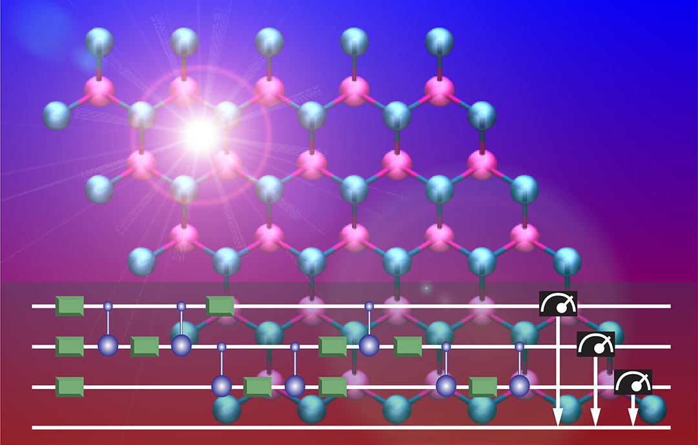

# MISTIQS: Multiplatform Software for Time-dependent Quantum Simulation

A full-stack, cross-platform software for generating, compiling, and executing quantum circuits for simulating quantum many-body dynamics of systems governed by Heisenberg Hamiltonians.

MISTIQS provides the following primary capabilities:

1) Generation of quantum circuits for performing quantum simulations of the dynamics of spin chains governed by input Heisenberg Hamiltonians

2) Translation of these quantum circuits into executable circuit objects for IBM, Rigetti, and Googele quantum devices (Qiskit circuit objects, Pyquil programs, and Cirq circuit objects respectively)

3) Compilation of circuits, either using the compilers native to the quantum computing platform of choice or using the domain-specific IBM and Rigetti compilers developed for TFIM simulations (more information [here](https://arxiv.org/abs/2004.07418))

4) Execution of these circuits on IBM or Rigetti quantum processors

5) Post-processing and plotting of simulation results (limited to average magnetization data)

MISTIQS provides the user with extensive flexibility across its functionalities. Some examples include support for user-defined time dependence functions for external fields, full XYZ model support in Hamiltonian constructions, and options to only use portions of the code functionality (such as only generating the quantum circuits without execution or running existing quantum circuits through the integrated domain-specific compilers for optimization purposes).

# I. Getting Started
The core code of MISTIQS only requires numpy to run. Executing quantum circuits requires glob, and plotting them requires matplotlib. For generating and/or plotting quantum circuits for IBM hardware, qiskit is required (0.21.0 currently supported). Similarly, pyquil is required for Rigetti use cases (qvm 1.17.1 and quilc 1.21.0 current supported), and cirq is required for generating circuits for the Cirq platform (0.9.1 current supported).

# II. Importing the Software For Use

For full use of the software, simply add the **MISTIQS/src** directory to your path and run

    from Heisenberg import Heisenberg

Now you can create Heisenberg objects, which contain the full functionality of the software.

If you only want to use the domain-specific compilers, add the MISTIQS/src directory to your path and run

    from Heisenberg import ds_compiler

Now you can call **ds_compile()** on existing IBM or Rigetti quantum circuit objects.

Please see [documentation](https://github.com/USCCACS/MISTIQS/blob/master/docs/MISTIQS%20User's%20Guide.md), as well as [examples](https://github.com/USCCACS/MISTIQS/tree/master/examples) provided.